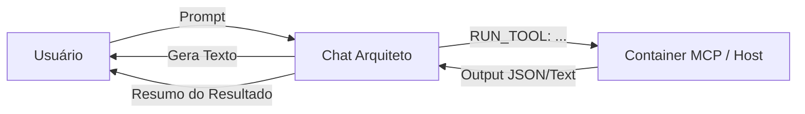

# 💬 A-PONTE Chat Capabilities (The Architect)

O **Chat-A-PONTE** (`python3 core/agents/architect.py`) não é apenas um chatbot passivo. Ele atua como um **Orquestrador de Agentes**, capaz de entender intenções em linguagem natural e invocar ferramentas especializadas do sistema via **MCP (Model Context Protocol)**.

## 1. O Cérebro Orquestrador

Quando você conversa com o Arquiteto, ele analisa sua solicitação e decide se deve:

1. **Responder com Texto/Código:** Para dúvidas conceituais ou geração de Terraform.
2. **Invocar um Agente:** Se você pedir uma ação concreta (auditar, testar, diagnosticar).

### Fluxo de Execução

## 2. Agentes Disponíveis (Tool Belt)

Você não precisa decorar comandos CLI. Basta pedir em português:

| Intenção do Usuário                  | Agente Invocado      | Comando Real         |
| ------------------------------------ | -------------------- | -------------------- |
| "Audite este repositório"            | **Git Auditor**      | `python3 core/tools/git_auditor.py` |
| "Verifique a segurança do Terraform" | **Security Auditor** | `python3 core/agents/auditor.py`  |
| "Por que deu erro no deploy?"        | **AI Doctor**        | `python3 core/services/doctor.py` |
| "Gere testes para este código"       | **Test Generator**   | `echo 'Em migração'`  |
| "Crie a documentação do projeto"     | **Doc Bot**          | `python3 core/tools/doc_bot.py`   |
| "Rode o pipeline completo"           | **Pipeline**         | `python3 core/tools/pipeline.py`  |
| "Encontre recursos órfãos/drift"     | **Drift Hunter**     | `aponte drift detect`     |
| "Quanto vai custar?"                 | **FinOps Agent**     | `infracost breakdown --path .`      |
| "Simule falha/caos"                  | **Chaos Monkey**     | `python3 core/tools/chaos_monkey.py`     |

## 3. Comandos Mágicos (Slash Commands)

Além da linguagem natural, o chat suporta comandos diretos para gestão de contexto:

- **/add <arquivo>**: Lê um arquivo local e adiciona à memória de curto prazo da IA.
  - _Ex: `/add terraform/main.tf`_
- **/ls [dir]**: Lista arquivos de um diretório para você saber o que adicionar.
  - _Ex: `/ls terraform`_
- **/tree**: Mostra a árvore de arquivos do projeto (visualização hierárquica).
- **/clear**: Limpa a memória de arquivos carregados (reset de contexto).
- **salvar**: Salva o último bloco de código gerado em um arquivo físico.

## 4. Protocolo de Contexto

Ao iniciar, o chat exige a definição de 4 variáveis imutáveis (`project_name`, `environment`, `app_name`, `resource_name`) para garantir que todo código gerado siga o padrão A-PONTE e não use nomes genéricos. O `resource_name` é usado para nomear o componente principal da infraestrutura (ex: `web-server`, `assets-bucket`).
